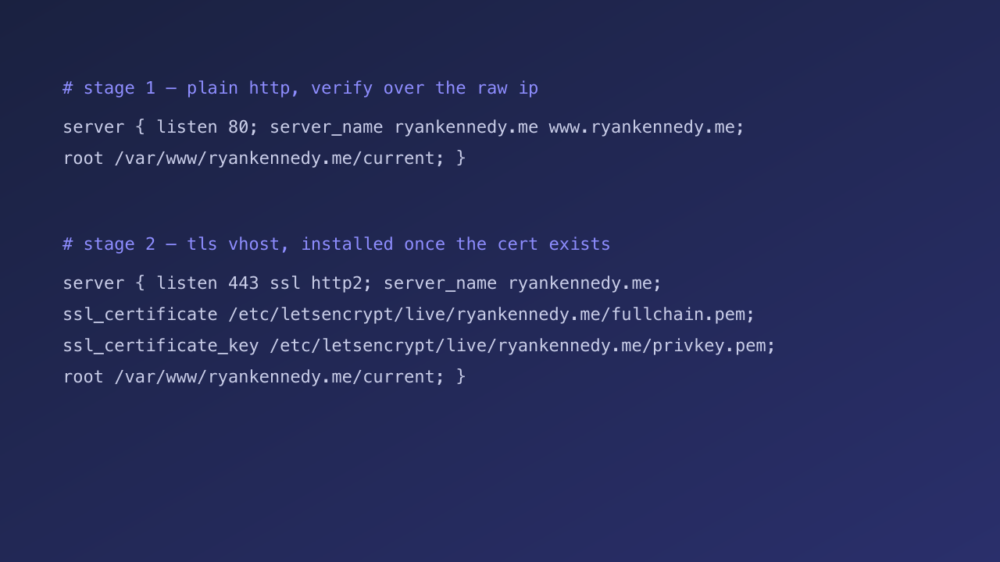

The droplet this replaces had been up for a year and fifteen weeks. It was running `unattended-upgrades`, and it still had 89 pending packages and a kernel that had been waiting on a reboot for 201 days. Nothing was wrong with it, exactly. It was just a server nobody could rebuild.

The fix is not to patch it harder. The fix is to make the server disposable, and the way to do that is to build the next one from a playbook short enough to read in one sitting.

## The shape of the cutover

Four stages, and the old box answers traffic through the first three.


## Provisioning

The playbook does one thing per task and verifies the thing it just did. The sshd step is the one people get wrong, so it reads the *running* configuration back rather than trusting the file it wrote.

```yaml title="infra/playbook.yml" {6-10}
- name: Read the running sshd configuration
  ansible.builtin.command: sshd -T
  register: sshd_effective
  changed_when: false

- name: Verify root login and password auth are actually disabled
  ansible.builtin.assert:
    that:
      - "'permitrootlogin no' in sshd_effective.stdout"
      - "'passwordauthentication no' in sshd_effective.stdout"
    fail_msg: "sshd drop-in was written but is not in effect"  # validation ≠ verification
```

> [!note] Why the assert matters
> A drop-in that parses is not a drop-in that applied. Twice I have called a change done on a clean validate and found the live process never picked it up.

## TLS before DNS

nginx refuses to start when a vhost points at certificate files that do not exist, and HTTP-01 cannot issue until DNS points at the new box. So the certificate comes from a DNS-01 challenge, with the API token placed for the issuance and removed immediately after.

> [!tip]
> Issue the cert for the apex *and* `www` in one go. A second issuance later means a second window where nginx points at a file that does not exist.



## The flip

Change the A record, watch the first request land on the new box, and leave the old one running for a week. Rollback is the same edit in reverse.

> [!warning] Watch the TTL
> Drop the record's TTL to 60 seconds an hour before the flip. The default 3600 means some resolvers keep sending traffic to the old box for an hour after you think you are done.

> The server is not a pet. It is not even cattle. It is a build artifact.
>
> <cite>— a note to myself, after the third rebuild</cite>

> [!danger] Do not
> Do not destroy the old droplet on the same day. The one time I did, the new box had a working site and a broken cron, and the only copy of the cron was on the box I had just deleted.

Then destroy it, and feel nothing, because it was never special.
